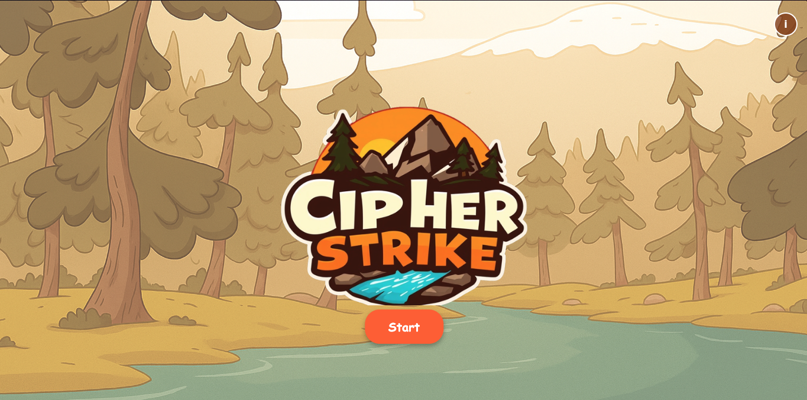
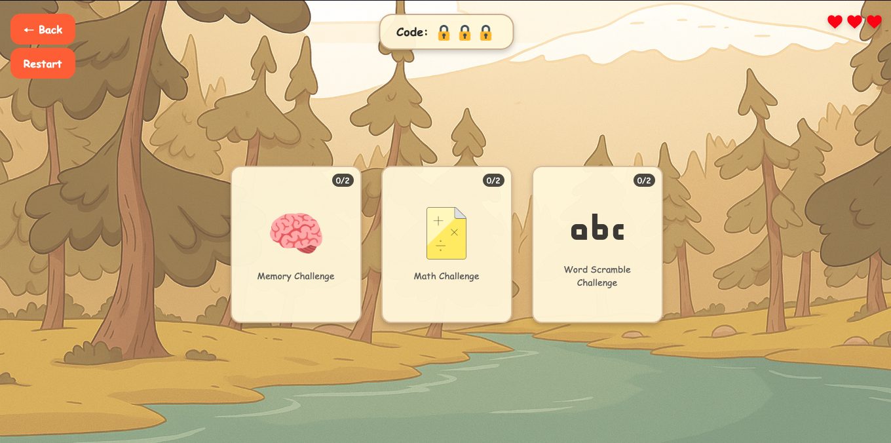
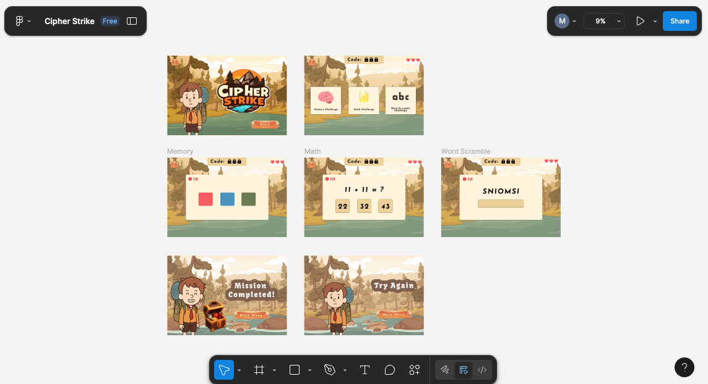

# 🔐 Cipher Strike

**Cipher Strike** is an exciting **puzzle-adventure game** that challenges players to crack a secret code by completing three different types of brain-teasing challenges. Test your **memory, math, and word skills** under pressure and see if you have what it takes to unlock the treasure!

---

## 📖 Game Description

Cipher Strike combines elements of **cognitive training** with **spy-themed gameplay**, making mental exercises both fun and engaging. Players must complete memory sequences, solve math problems, and unscramble spy-themed words to reveal a hidden 3-character code.

With a **lives system** and **time limits**, every decision matters as you race against the clock to complete your mission.

---

## 🕹️ Getting Started

🎮 **Play Now** → https://maryam308.github.io/Cipher-Strike-Browser-Based-Game/

---

## 📌 How to Play

1. Click **Start** on the splash screen.
2. Complete **2 challenges from each of the 3 categories**:

   - 🧠 **Memory Challenge**: Watch and repeat color sequences.
   - ➗ **Math Challenge**: Solve arithmetic problems quickly.
   - 🔤 **Word Scramble**: Unscramble spy-themed words using hints.

3. Each completed challenge type reveals **1 character of the secret code**.
4. You have **3 lives** – lose them all, and the mission fails.
5. Complete all challenges to crack the code and **win the treasure!**

---

## 🎨 Planning Materials

- **Figma Mockup** → [View Design](https://www.figma.com/design/1FPi0f9JVIr6x0SqNRsBqQ/Cipher-Strike?node-id=0-1&t=wCcHAZdeQoO9GHku-1)
  
- **User Stories** → [View Document](https://drive.google.com/file/d/17BnEYRopcnbbCRs0Vxl3io79VY6TJ32-/view?usp=sharing)

---

## 🎵 Attributions

- **Audio Assets**: Background music and sound effects from [Pixabay](https://pixabay.com/)
- **Design Inspiration**: Color scheme and visual style inspired by Pinterest
- **Generated Assets**: Created with ChatGPT assistance

---

## 💻 Technologies Used

- **JavaScript**: Game logic, state management, interactivity
- **HTML**: Structure and semantic markup
- **CSS**: Styling, animations, responsive design

---

## ⚙️ Key JavaScript Features

- Event listeners & DOM manipulation
- Array methods & data structures
- Timing functions (`setInterval`, `setTimeout`)
- Random number generation

---

## 🎮 Game Features

### Core Gameplay

- 🧩 **Three Challenge Types**: Memory, Math, Word Scramble
- 📈 **Progressive Difficulty**: Challenges get harder as you advance
- ❤️ **Lives System**: Limited attempts add strategy
- ⏱ **Timer-Based Challenges**: Pressure and excitement
- 🔑 **Secret Code Revelation**: Visual feedback as you progress

### Technical Features

- 📱 **Responsive Design**: Play on desktop or mobile
- 🔊 **Audio Integration**: Background music & sound effects
- 🔄 **State Management**: Tracks progress & challenges
- 🎲 **Challenge Randomization**: Prevents repetition

---

## 🚀 Next Steps

### Game Enhancements

- Difficulty Levels: Easy / Medium / Hard modes
- Additional Challenge Types: Logic puzzles, patterns, spatial reasoning
- Power-ups: Extra time, skip challenge, bonus lives

### Technical Improvements

- Local Storage: Save progress & high scores
- Multiplayer Mode: Real-time competition

### Content Expansion

- Story Mode: Extended missions with multiple levels and characters

### Visual & Audio Enhancements

- Enhanced graphics & character animations
- Multi-language localization

---

## 🧠 Ready to test your mental agility?

Start your mission in **Cipher Strike** and see if you can crack the code!
